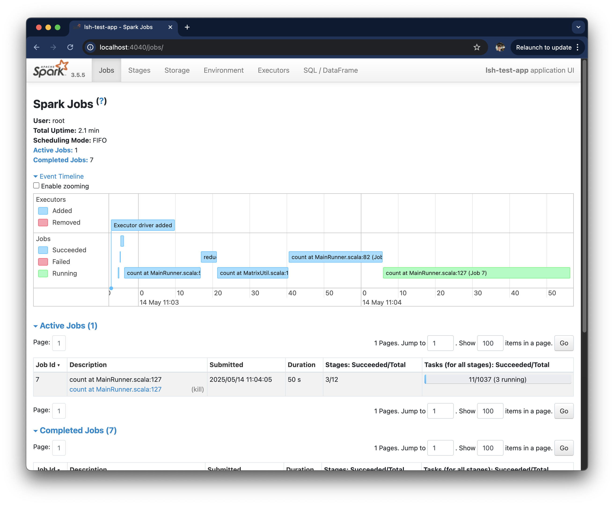

## Overview

This project is a massively distributed implementation of the Locality Sensitive Hashing.
LSH can efficiently compare long sequences of characters, e.g. documents.

Project implemented here helps to answer whether LSH is useful for comparing shorter strings. 
In order to do that, this program will evaluate LSH effectiveness on a dataset of real questions 
from Google search.

Tools used: Spark, Scala, Docker.

## Results

It turns out, LSH does not work well with short strings - it produces a very high percentage of false positives.
My suspicion is that in short strings it's really hard to distinguish them based on their semantic meaning. I tried
multiple ways to optimize the precision, e.g. cutting common prefixes such as "Does" or "What", 
but the results were not satisfactory.

## Results table

| Shingle size | Signature size | Number of bands | TP     | FP     |
|--------------|----------------|-----------------|--------|--------|
| 5            | 100            | 20              | 31533  | 28780  |
| 8            | 1000           | 100             | 12143  | 13572  |


## Running the program
Docker configuration is provided in `Dockerfile` and `docker-compose.yml`.
In order to run it, one needs to execute:
```adlanguage
docker build -t lsh-app:latest .
docker run -p 8080:4040 --rm lsh-app:latest
```
The Spark UI will be available at `http://0.0.0.0:8080/jobs/`
Screenshot of the execution on the cluster:

